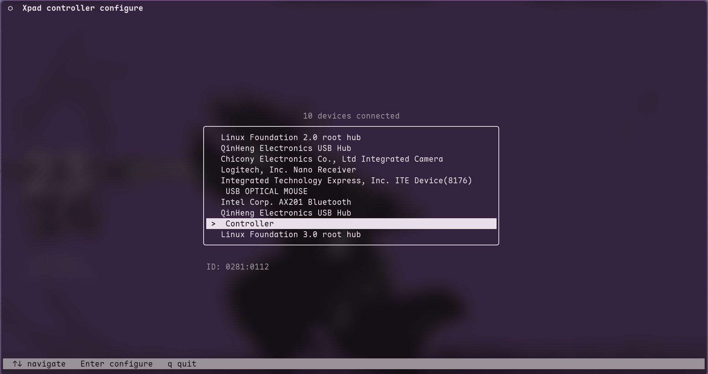
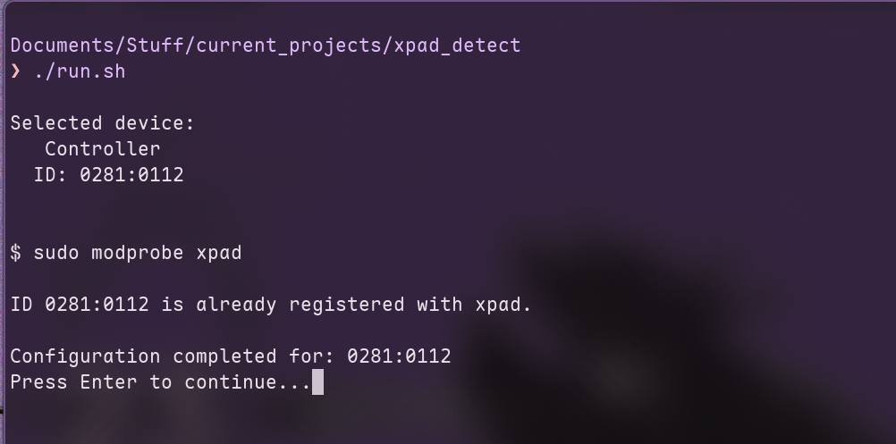

# Xpad Connector

using Xinput controllers in linux can be a hassble because sometimes it connects but does not work, its probably a xpad issue with your controller's id not being in its recognizable list, we fix that.

## screenshots

